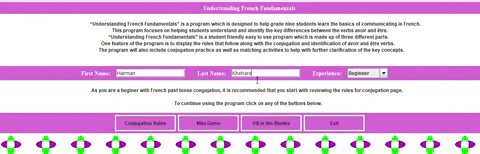

# Understanding-French-Fundamentals

Understanding French Fundamentals is a simple French program created to assist students with understanding the basics of past tense conjugation in the French language. This program aims to help grade nine students learn the basics of communicating in French by learning to identify the key differences between the verbs avoir and être. This program was designed and coded by Hiba Bhutta and Harman Khehara as part of the final project for a grade 12 computer science course.

  

